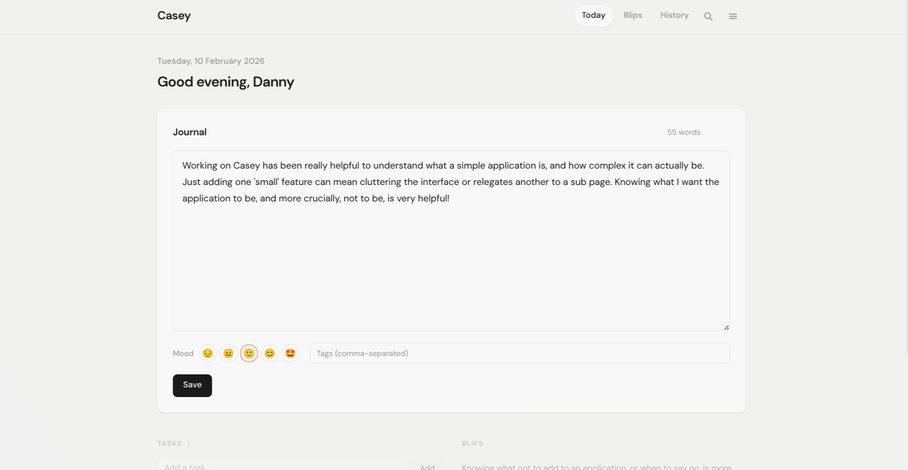

# Casey

[](https://buymeacoffee.com/d3hkz6gwle)

A calm, focused productivity app for daily journaling, lightweight task management, and idea resurfacing. Built with Flask and SQLite.

   

Named after [Casey Newton](https://www.theverge.com/authors/casey-newton), whose productivity approach on the [Hard Fork podcast](https://www.nytimes.com/column/hard-fork) inspired this tool.

## Screenshots

<p align="center">
  
</p>

## Features

- **Daily Journaling**: One entry per day with autosave, Markdown support, mood tracking, and tagging
- **Journal Templates**: Customizable writing prompts (Morning Pages, Weekly Review, Daily Standup, Brain Dump) to get you started
- **Task Management**: Due dates, priorities, subtasks, recurrence (daily/weekly/monthly), and completion history
- **Blips**: Capture quick thoughts that randomly resurface each day using weighted spaced repetition, keeping good ideas alive
- **Calendar View**: Monthly mood visualization with writing streak tracking
- **Full-Text Search**: Search across journal entries, tasks, and blips
- **Dark Mode**: Automatic theme detection with manual toggle
- **Multi-User**: User registration, authentication, and per-user data isolation
- **Two-Factor Auth**: TOTP-based 2FA with QR code setup
- **API Access**: Personal API tokens with full REST endpoints for journal, tasks, and blips
- **Import/Export**: JSON and CSV export, JSON import for backups and migration
- **Admin Panel**: User management, audit logging, and usage statistics
- **Docker Ready**: Single-container deployment with Gunicorn

## How It Works

The blips system is the key differentiator. Unlike traditional note-taking where ideas get buried, Casey randomly surfaces old thoughts alongside your daily journal. The surfacing algorithm weights blips so that less-seen and older ideas come up more often, while pinned blips get a boost. This creates serendipitous connections and ensures good ideas don't die in your archive.

**Daily workflow:**
1. Open Casey in the morning
2. See a few random blips from your backlog
3. Journal freely (blips spark new connections)
4. Add tasks as they come up
5. Capture new blips throughout the day

## Installation

### Quick Start with Docker

```bash
# Create a directory for Casey
mkdir casey && cd casey

# Download docker-compose.yml
curl -O https://raw.githubusercontent.com/dannymcc/casey/master/docker-compose.yml

# Create your environment file
cp .env.example .env
# Edit .env and set a strong SECRET_KEY

# Start the container
docker compose up -d
```

Or run directly:

```bash
docker run -d \
  --name casey \
  -p 5090:5090 \
  -v casey-data:/app/data \
  -e SECRET_KEY=your-secret-key \
  ghcr.io/dannymcc/casey:latest
```

Access the application at `http://localhost:5090`

The first registered user is automatically promoted to admin.

### Manual Installation

```bash
# Clone the repository
git clone https://github.com/dannymcc/casey.git
cd casey

# Create virtual environment
python3 -m venv venv
source venv/bin/activate

# Install dependencies
pip install -r requirements.txt

# Run
python app.py
```

Visit `http://localhost:5090`

## Configuration

Copy `.env.example` to `.env` and configure:

| Variable | Description | Default |
|----------|-------------|---------|
| `SECRET_KEY` | Session encryption key | Required |
| `FLASK_DEBUG` | Enable debug mode | `False` |
| `VERSION` | App version display | `dev` |

## API

Casey includes a REST API for automation and integrations. Generate a personal API token in Settings > API.

```bash
# List journal entries
curl -H "Authorization: Bearer your_api_token" \
  http://localhost:5090/api/journal

# Create a journal entry
curl -X POST -H "Authorization: Bearer your_api_token" \
  -H "Content-Type: application/json" \
  -d '{"date": "2026-02-10", "content": "Hello from the API"}' \
  http://localhost:5090/api/journal/2026-02-10
```

### Available Endpoints

| Method | Endpoint | Description |
|--------|----------|-------------|
| GET | `/api/journal` | List journal entries |
| GET/POST | `/api/journal/<date>` | Get or create/update entry by date |
| GET/POST | `/api/tasks` | List or create tasks |
| GET/PUT/DELETE | `/api/tasks/<id>` | Get, update, or delete a task |
| GET/POST | `/api/blips` | List or create blips |
| GET/DELETE | `/api/blips/<id>` | Get or delete a blip |

## Data Backup

Your data lives in a single SQLite file at `data/casey.db` inside the container volume.

**Using the built-in export:**
- Go to Settings > Data > Export to download a full JSON or CSV backup

**Manual backup:**
```bash
docker cp casey:/app/data/casey.db ./backup-$(date +%Y-%m-%d).db
```

## Tech Stack

- **Backend**: Python 3.11 / Flask
- **Database**: SQLite with FTS5 full-text search
- **Frontend**: Vanilla HTML/CSS/JS (no framework)
- **Fonts**: DM Sans, JetBrains Mono (Google Fonts)
- **Server**: Gunicorn
- **Auth**: Flask-WTF CSRF, bcrypt passwords, TOTP 2FA
- **Rate Limiting**: Flask-Limiter

## Contributing

Contributions are welcome! Please feel free to submit a Pull Request.

### Development Setup

1. Clone this repository
2. Create a virtual environment: `python3 -m venv venv`
3. Activate it: `source venv/bin/activate`
4. Install dependencies: `pip install -r requirements.txt`
5. Run in development mode: `python app.py`

## License

This project is licensed under the MIT License - see the [LICENSE](LICENSE) file for details.

## Support

- **Issues**: [GitHub Issues](https://github.com/dannymcc/casey/issues)

---

**Made by [Danny McClelland](https://github.com/dannymcc)**
